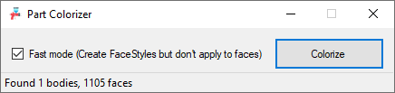

# Part Colorizer for Solid Edge

The scope of this tool is to create FaceStyles for an imported file.
All the faces in all the design bodies in the part are parsed with the help of the method Face.GetRGBAVals a new FaceStyle is created

**Please note:** With the actual methods is not possible to obtain more information than the Face Color, the obtained values are used for Diffuse, Ambient and Wireframe colors. The alpha value is not the Opacity and in the tested models is always set to 1

Still a work in progress

**Fast Mode (Create FaceStyles but don't apply to faces):** With this option checked the FaceStyles created during faces parsing will not be applied to the related faces

ToDo: Investigate why performances slow down while applying FaceStyles to faces
- Open in background doesn't speed up the process
- Application.Interactive to false doesn't speed up the process
- Application.ScreenUpdating to false doesn't speed up the process
- Application.DelayCompute to true doesn't speed up the process
